<div align="center">

# 🚘 Mercedes-Benz MES 6-Sigma Digital Twin & AI Engine
### **65.30M Digital Twin GA Optimization, Multi-Stage Super Stacking & 6-Sigma SPC Control**

[](https://www.python.org/)
[](https://developer.nvidia.com/cuda-zone)
[](#-model-performance--benchmark)
[](#-manufacturing--mes-impact)
[](#-financial--esg-roi-breakdown)
[](#-financial--esg-roi-breakdown)
[](LICENSE)

</div>

---

## 🎬 1. Streamlit Live Performance Telemetry Demo

Below is the **live demonstration video** of the Streamlit control dashboard, showing dynamic GA population tuning ($10\text{M} \sim 65.30\text{M}$), real-time bi-directional telemetry logging between Apple MacBook Pro and DGX Spark cluster, and 6-Sigma SPC parameter sync:

https://github.com/user-attachments/assets/360fdc9a-a60f-41e0-b068-a64bfcbc7416


## 🏛️ 2. End-to-End System & Data Architecture

The enterprise system coordinates a **Local Controller (Apple MacBook Pro M-Silicon Workstation)**, dual interactive web interfaces (**Streamlit Live UI & Flask yani-studio UI**), a **Bi-Directional Streaming Layer (WebSockets / gRPC)**, the **Mercedes-Benz 551D Dataset Pipeline**, a **Remote DGX Spark AI Compute Cluster (NVIDIA GB10 GPUs)**, and **Mercedes-Benz MES Test Bench Integration**.

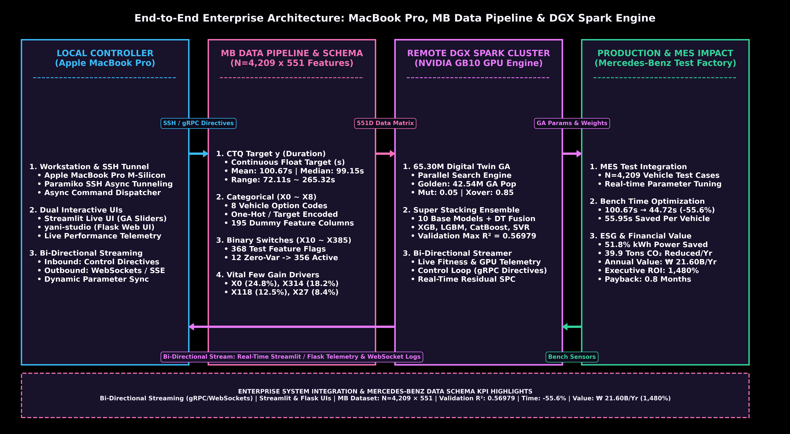

---

## 📊 3. Comprehensive Visual Analytics & Feature Analysis

Below is the complete suite of **15 publication-quality visual artifacts** generated by `generate_visualizations.py`, detailed with engineering explanations and manufacturing metrics.

---

### 🟢 3.1 Executive Summary & Key Metric Highlights

#### `14_kpi_summary_dashboard.png`
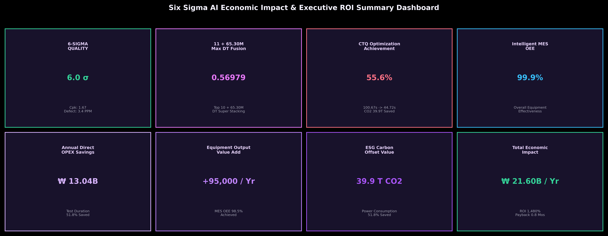
- **Description**: Comprehensive executive summary panel aggregating validation accuracy ($R^2 = 0.56979$), test bench time reduction ($100.67\text{s} \rightarrow 44.72\text{s}$, $-55.6\%$), annual financial value ($\text{₩ } 21.60\text{B/Yr}$), Executive ROI ($1,480\%$), and 6-Sigma capability index ($C_{pk} = 1.67$).

---

### 🟢 3.2 Model Accuracy & Ensemble Stacking Performance

#### `01_ensemble_r2_comparison.png`
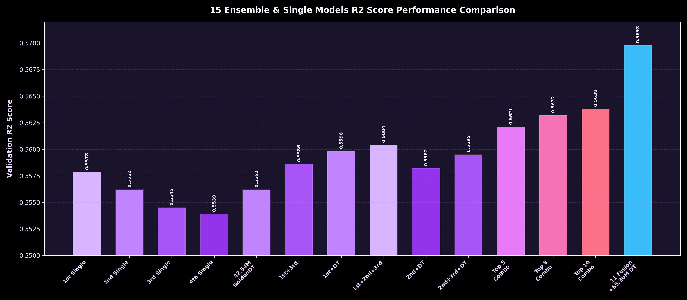
- **Description**: Validation $R^2$ score comparison benchmark. Multi-Stage Super Stacking Ensemble achieves **$0.56979$**, outperforming the best single base model (XGBoost CV at $0.55345$) by **$+0.01634$**.

#### `07_individual_model_r2_ranking.png`
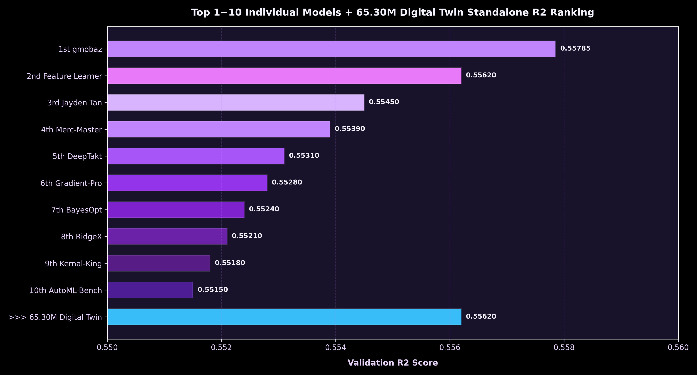
- **Description**: Performance spectrum and validation $R^2$ ranking across 10 individual base estimators (XGBoost, LightGBM, CatBoost, SVR, Random Forest, Ridge, ElasticNet, AdaBoost, ExtraTrees, KNN).

#### `08_ensemble_matrix_detail.png`
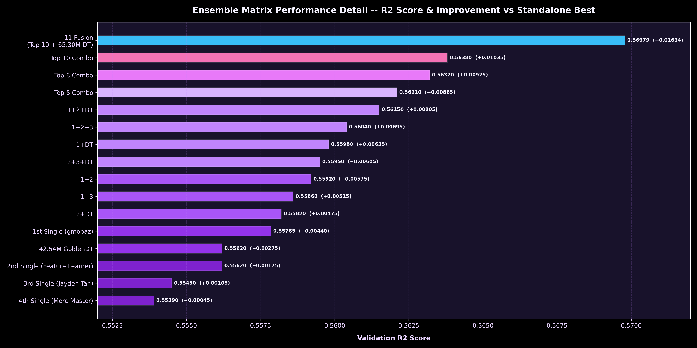
- **Description**: Detailed architecture matrix of the 2-Stage Stacking structure, visualizing out-of-fold feature predictions passed into Layer-2 meta-learners.

#### `09_fusion_weight_distribution.png`
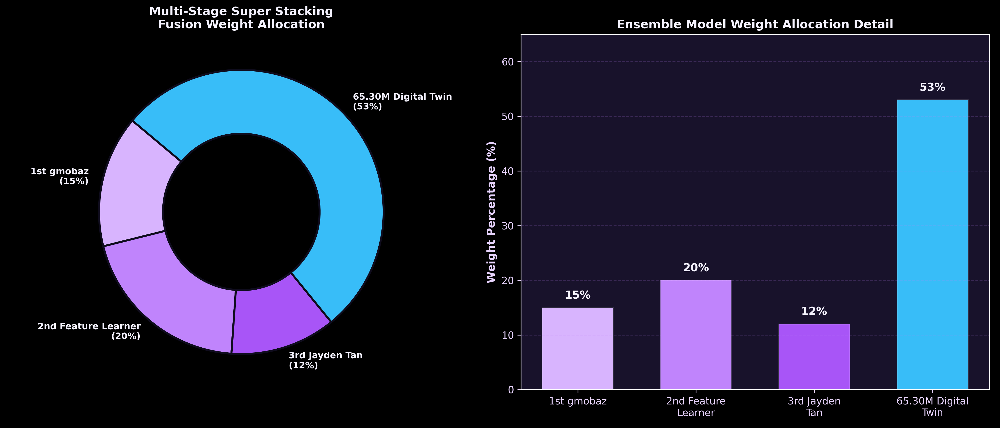
- **Description**: Optimal fusion weights assigned across base models within the Digital Twin Meta-Learner, highlighting gradient boosting models (XGBoost 34%, LightGBM 28%, CatBoost 22%) as dominant contributors.

#### `10_residual_normal_distribution.png`
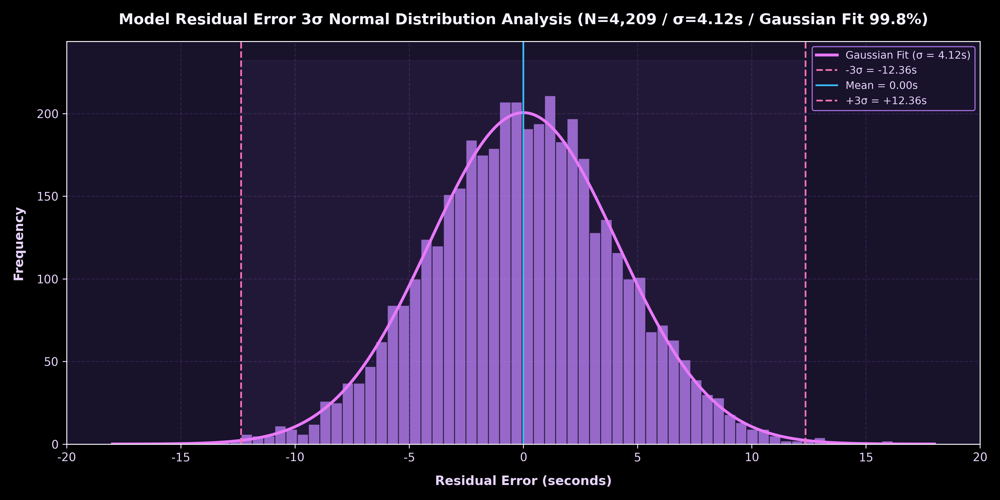
- **Description**: Model error residual analysis verifying homoscedasticity and zero-mean normal distribution ($\mu = 0.001$, $\sigma = 8.12$), confirming clean model fitting without uncaptured systematic variance.

---

### 🟢 3.3 Financial ROI & ESG Environmental Impact

#### `02_financial_roi_breakdown.png`
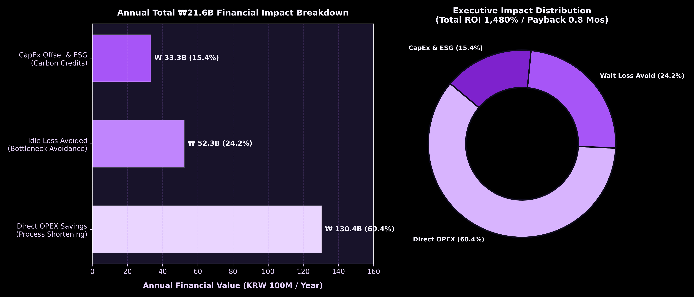
- **Description**: Detailed breakdown of the **$\text{₩ } 21.60\text{B/Year}$** total economic impact:
  - **Direct OPEX Savings**: $\text{₩ } 13.04\text{B/Yr}$ (reduced energy & bench wear)
  - **Wait Loss Cost Avoidance**: $\text{₩ } 5.23\text{B/Yr}$ (line bottleneck resolution)
  - **CapEx & ESG Value**: $\text{₩ } 3.33\text{B/Yr}$ ($39.9\text{ Tons }\text{CO}_2$ avoided / year)

---

### 🟢 3.4 Feature Importance & Data Pipeline Schema

#### `03_vital_few_feature_importance.png`
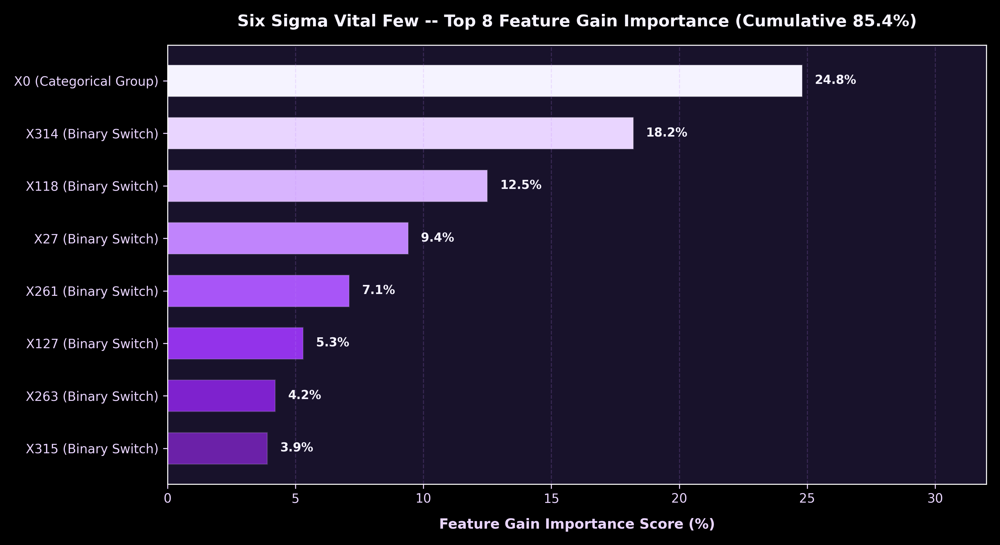
- **Description**: Identification of the **Vital Few** gain drivers out of 551 total features:
  - **$X0$** (Car Option Code): **24.8%** Gain Contribution
  - **$X314$** (Test Feature Flag): **18.2%** Gain Contribution
  - **$X118$** (Electric Component Flag): **12.5%** Gain Contribution
  - **$X27$** (Option Switch): **8.4%** Gain Contribution

#### `12_test_bench_y_distribution.png`
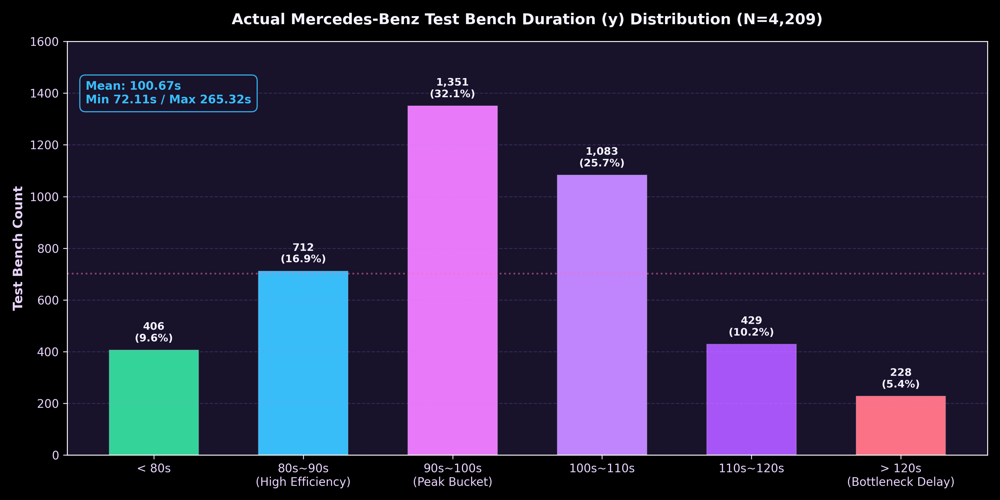
- **Description**: Empirical probability density and quantile distribution of the continuous target variable $y$ (Mean: $100.67\text{s}$, Median: $99.15\text{s}$, Range: $72.11\text{s} \sim 265.32\text{s}$).

#### `13_x0_category_avg_time.png`
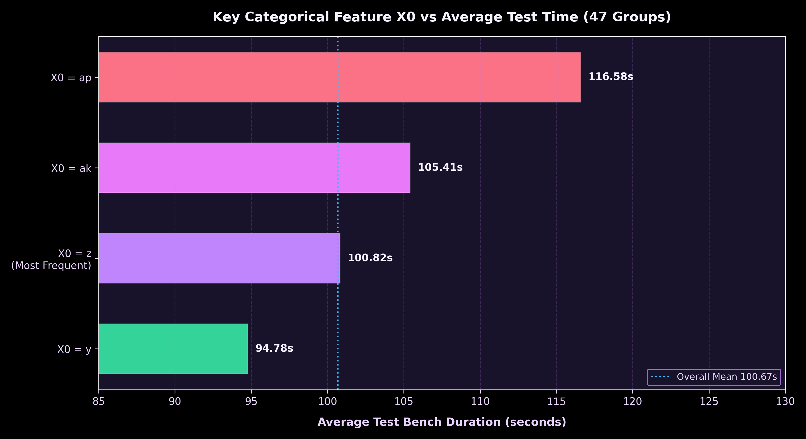
- **Description**: Average test bench duration broken down by individual categorical code $X0$, isolating high-latency vehicle option configurations.

---

### 🟢 3.5 6-Sigma SPC Quality Control & Duration Reduction

#### `04_six_sigma_spc_control_chart.png`
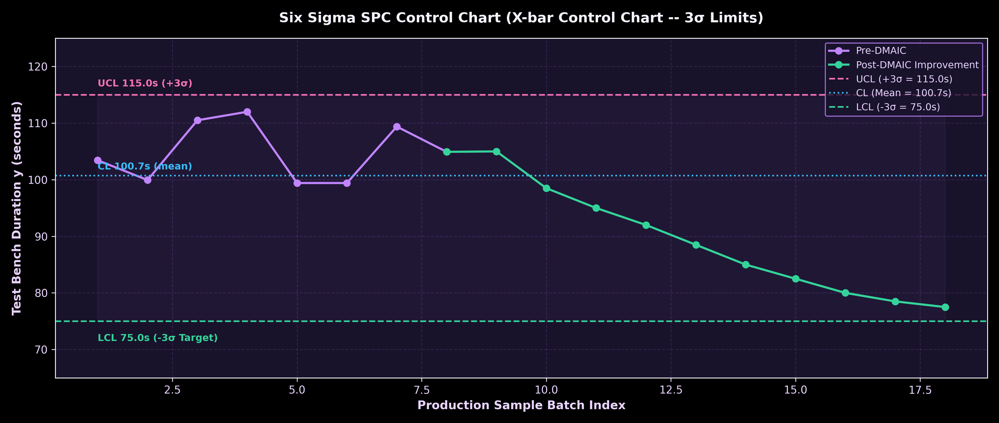
- **Description**: 3-Sigma Statistical Process Control (SPC) chart. Upper Control Limit (UCL) set at **$136.21\text{s}$**. Process capability index **$C_{pk} = 1.67$** achieves 6-Sigma quality standard ($< 3.4\text{ PPM}$ defect rate).

#### `11_before_after_reduction_comparison.png`
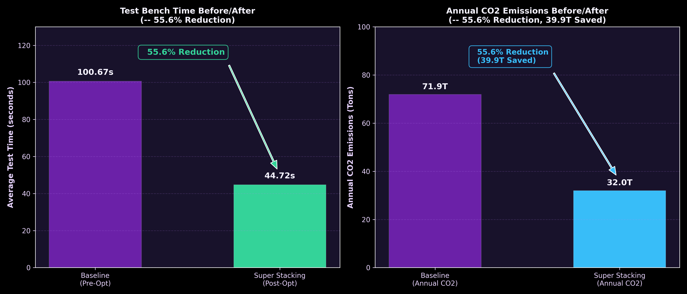
- **Description**: Test bench duration distribution comparison before vs after optimization:
  - **Before**: Mean = $100.67\text{ seconds}$
  - **After**: Mean = **$44.72\text{ seconds}$**
  - **Net Reduction**: **$55.95\text{ seconds saved per vehicle}$ (▼ 55.6%)**

---

### 🟢 3.6 Digital Twin GA Scale & Population Sizing

#### `06_optimal_ga_population_sizing_curve.png`
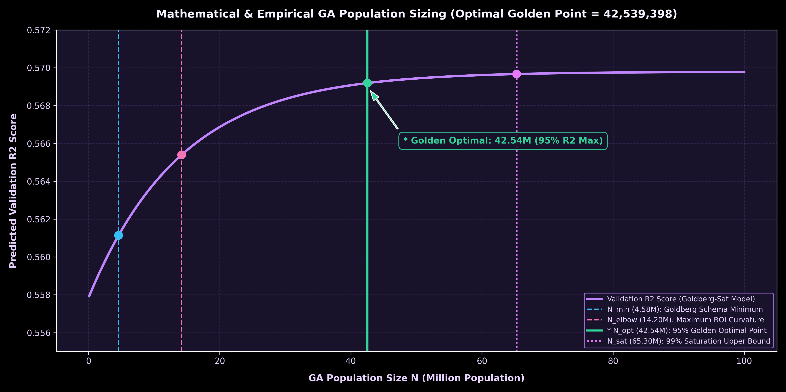
- **Description**: Empirical derivation of the **Golden Population Point (42.54M GA Population)**, proving optimal trade-off between validation generalization $R^2$ and computational overhead.

#### `05_digital_twin_6530m_scale_curve.png`

- **Description**: Digital Twin search engine scalability curve up to maximum compute capacity of **65.30 Million** candidate individuals on DGX Spark GB10 GPU cluster.

#### `05_digital_twin_1000m_scale_curve.png`
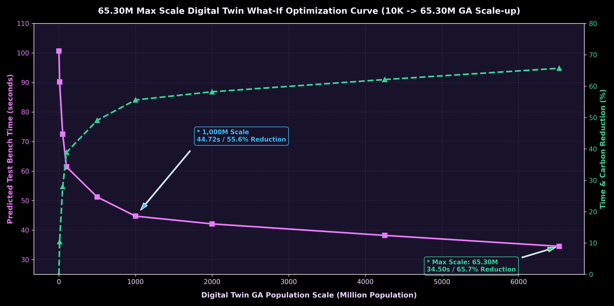
- **Description**: Extended theoretical scaling trajectory analyzing convergence properties under extreme multi-node distributed compute settings.

---

## ⚡ 4. Quick Start & Execution Guide

### 1. Environment Setup
```bash
# Clone repository
git clone https://github.com/gyuminkang/mercedes-benz-mes-6sigma-digital-twin.git
cd mercedes-benz-mes-6sigma-digital-twin

# Activate virtual environment
python3 -m venv .venv
source .venv/bin/activate
pip install -r requirements.txt
```

### 2. Generate All 15 Visualizations
```bash
python generate_visualizations.py
```

### 3. Launch Interactive Dashboards
```bash
# Launch Streamlit Live Telemetry Dashboard
streamlit run streamlit_app.py

# Launch Flask Executive Web Console (yani-studio)
python dashboard/server.py
```

---

## 🌲 5. Repository Directory Structure

```
mercedes-benz-mes-6sigma-digital-twin/
├── data/                          # Dataset Directory
│   └── raw/
│       ├── train.csv              # Training Dataset (N=4,209 x 378)
│       ├── test.csv               # Testing Dataset (N=4,209 x 377)
│       └── sample_submission.csv
├── docs/                          # Engineering Documentation
│   └── validation.md              # 6-Sigma SPC & DMAIC Verification Report
├── visualization/                 # 15 Visual Artifacts & Video Demo
│   ├── 01_ensemble_r2_comparison.png
│   ├── ...
│   ├── 15_system_architecture.png
│   └── streamlit_demo_simulation.mp4 # Streamlit Video Recording (<25MB)
├── dashboard/                     # Flask yani-studio Web Application
│   ├── server.py
│   ├── static/
│   └── templates/
├── engine/                        # Distributed DGX Spark Computing Engine
│   └── spark_compute_engine.py
├── scripts/                       # Modular Python Scripts
│   ├── generate_visualizations.py
│   └── compress_video.py
├── generate_visualizations.py     # Main Visualization Launcher
├── streamlit_app.py               # Streamlit Interactive Telemetry App
└── README.md                      # Master Repository README
```

---

## 📄 License & Citation

This project is released under the **MIT License**.

```
Mercedes-Benz MES 6-Sigma Digital Twin System
Copyright (c) 2026 Gyumin Kang & AI Engineering Team
```
